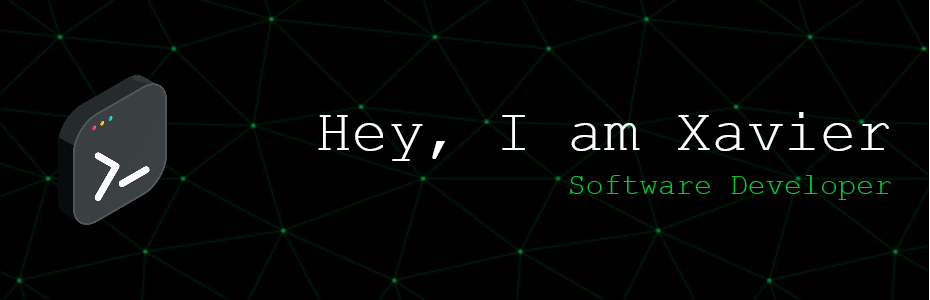

I've been learning to code during the last 2 years at Hive Helsinki, after changing paths from my background in psychology. I have experience with C, C++ and Kotlin. I enjoy code that runs fast and with little memory footprint. I am currently learning to use TypeScript, PHP and Node.js, creating a simple web game

*   🌍  I'm based in Helsinki
*   🧠  I'm currently learning Kotlin and TypeScript
   ### Skills 

                    
  ### Socials
                                 
  

    <a href="https://www.github.com/xrierac" target="_blank" rel="noreferrer">
                    <picture>
                    <source media="(prefers-color-scheme: dark)" srcset="https://raw.githubusercontent.com/danielcranney/readme-generator/main/public/icons/socials/github-dark.svg" />
                    <source media="(prefers-color-scheme: light)" srcset="https://raw.githubusercontent.com/danielcranney/readme-generator/main/public/icons/socials/github.svg" />
                    
                    </picture>
  </a>

  
   ### Badges
  
